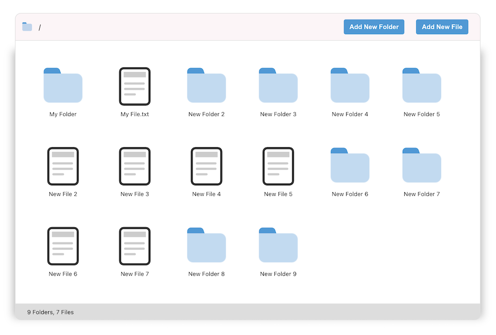

<br />
<p align="center">
    
  </a>

  <h3 align="center">File System</h3>

  <p align="center">
    This project is mock implementation of file system. You can create, read, update, delete files and directories.
    <br />
    <br />
    <br />
    <a href="https://file-system-anuj.vercel.app/">View Demo</a>
    ·
    <a href="https://github.com/anujverma000/file-system/issues">Report Bug</a>
  </p>
</p>


<!-- TABLE OF CONTENTS -->
## Table of Contents

* [About the Project](#about-the-project)
  * [Built With](#built-with)
* [Getting Started](#getting-started)
  * [Installation](#installation)
* [Roadmap](#roadmap)
* [Contact](#contact)


<!-- ABOUT THE PROJECT -->
## About The Project
<kbd>

</kbd>

<br />
<br />
<br />
<br>
<ul>
  <li>Folder can have subfolders and files to many levels.</li>
  <li>You can click on the folder to see the subfolders and files in it. </li>
  <li>To Rename the folder or file, you can click on the name of it and it will be editable.</li>
  <li>Its restricted to create files or folders with the same name.</li>
  <li>You can also create a new folder or file by clicking on the buttons in the header.</li>
  <li>You can also delete a folder or file by clicking on the button on hover of it.</li>
</ul>

### Built With
This is a [React.js](https://reactjs.org/) project bootstrapped with [`create-next-app`](https://create-react-app.dev/).

* [React](https://reactjs.org/)
* [Typescript](https://www.typescriptlang.org/)
* [Styled Components](https://styled-components.com/)

For Deployment, Using vercel's Github build pipeline
* [Vercel](https://vercel.com/) 


<!-- GETTING STARTED -->
## Getting Started

To get a local copy up and running follow these simple steps.

### Installation

1. Clone the repo
```sh
git clone https://github.com/anujverma000/file-system.git
```
2. Install dependencies
```sh
yarn
```


3. Run the development server:

```bash
yarn start
```

<!-- ROADMAP -->
## Roadmap

See the [open issues](https://github.com/anujverma000/file-system/issues) for a list of proposed features (and known issues).

<!-- CONTACT -->
## Contact

Anuj Verma - [@anujverma000](https://twitter.com/anujverma000) - anujverma000@gmail.com

Project Link: [https://github.com/anujverma000/file-system](https://github.com/anujverma000/file-system)
